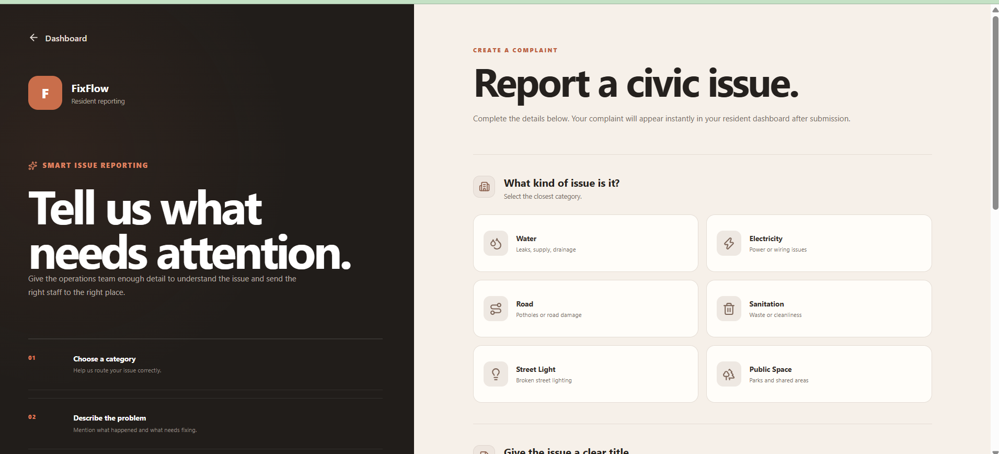
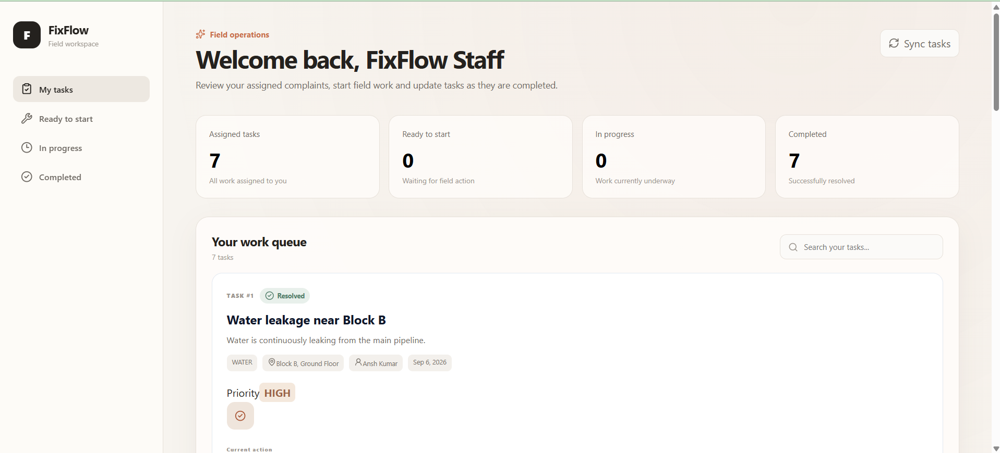
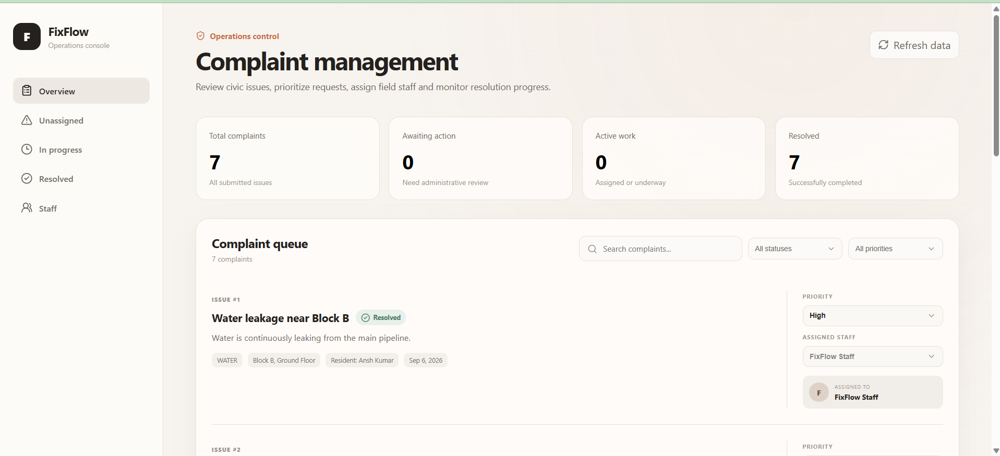

# FixFlow

### Smart Civic Complaint & Maintenance Management System

FixFlow is a full-stack web application designed to simplify the process of reporting, managing, assigning, and resolving civic and facility-related complaints.

The system provides dedicated workspaces for **Residents, Administrators, and Field Staff**, allowing a complaint to move through a complete workflow — from initial reporting to final resolution.

---

## 🌐 Live Demo

**Live Application:** https://fix-flow-ansh-ok.vercel.app

FixFlow is deployed as a full-stack cloud application using:

- **Frontend:** Vercel
- **Backend:** Railway
- **Database:** Railway MySQL

> Public registration creates a Resident account. Administrator and Staff roles are provisioned separately for security.

---

## 📌 Project Overview

Traditional complaint-management processes often lack transparency, structured prioritization, clear responsibility assignment, and real-time status visibility.

FixFlow provides a centralized platform where:

- Residents can report civic issues and monitor their complaints.
- Administrators can review complaints, set priorities, and assign field staff.
- Staff members can view assigned tasks and update their progress.
- Complaint status is tracked throughout its complete lifecycle.
- Role-based authorization protects administrative and staff operations.

The application uses a **React + Vite frontend**, **Spring Boot REST API**, **MySQL database**, and **JWT-based authentication**.

---

## 📸 Screenshots

### Resident Issue Reporting

Residents can select an issue category, provide complaint details, specify a location, and submit civic problems directly to the system.



### Admin Complaint Management

Administrators can monitor complaints, filter the complaint queue, change priorities, and assign staff members.



### Staff Field Workspace

Assigned staff can view their work queue and move complaints through the resolution workflow.



---

## ✨ Core Features

### 👤 Resident

- Secure account registration and login
- Submit civic complaints
- Select complaint categories
- Provide issue title, description, and location
- View personal complaint history
- Track complaint status
- View complaint priority
- View assigned staff information
- Complaint lifecycle visualization
- Responsive resident dashboard

### 🛡️ Administrator

- Secure administrator dashboard
- View all submitted complaints
- Search complaints
- Filter complaints by status
- Filter complaints by priority
- Set complaint priority
- Assign field staff
- Monitor active work
- Monitor resolved complaints
- View operational statistics

### 🛠️ Field Staff

- Secure staff workspace
- View assigned complaints
- Search assigned tasks
- View complaint priority and location
- Start assigned work
- Update complaint status
- Mark completed work as resolved
- Monitor personal task statistics

---

## 🔄 Complaint Workflow

```text
Resident
   │
   │ Reports issue
   ▼
 OPEN
   │
   │ Admin reviews complaint
   │ Sets priority
   │ Assigns staff
   ▼
 ASSIGNED
   │
   │ Staff begins work
   ▼
 IN_PROGRESS
   │
   │ Staff completes work
   ▼
 RESOLVED
```

This workflow provides clear ownership, accountability, and visibility throughout the complaint lifecycle.

---

## 👥 Role-Based Architecture

FixFlow supports three application roles:

| Role | Responsibility |
|------|----------------|
| `RESIDENT` | Reports and tracks civic issues |
| `ADMIN` | Prioritizes complaints and assigns staff |
| `STAFF` | Handles assigned complaints and updates progress |

Authorization is enforced by the **Spring Boot backend** rather than relying only on frontend route protection.

This ensures that protected administrative and staff APIs cannot be accessed simply by navigating to restricted frontend routes.

---

## 🧰 Technology Stack

### Frontend

- React
- Vite
- JavaScript
- Axios
- React Router
- CSS
- Lucide Icons

### Backend

- Java
- Spring Boot
- Spring Security
- Spring Data JPA
- Hibernate
- REST APIs
- Maven

### Authentication & Security

- JSON Web Tokens (JWT)
- BCrypt password hashing
- Stateless authentication
- Role-based authorization
- Protected REST endpoints
- Configurable CORS policy

### Database

- MySQL

### Deployment

- Vercel
- Railway
- Railway MySQL

### Development & Testing Tools

- IntelliJ IDEA
- Visual Studio Code
- Postman
- Git
- GitHub

---

## 🏗️ System Architecture

```text
┌───────────────────────────────┐
│          React + Vite         │
│                               │
│ Resident │ Admin │ Staff      │
└───────────────┬───────────────┘
                │
                │ HTTPS / REST API
                │ JWT Bearer Token
                ▼
┌───────────────────────────────┐
│       Spring Boot Backend     │
│                               │
│ Controllers                   │
│ Services                      │
│ Spring Security + JWT         │
│ Spring Data JPA               │
└───────────────┬───────────────┘
                │
                │ JPA / Hibernate
                ▼
┌───────────────────────────────┐
│             MySQL             │
│                               │
│ Users                         │
│ Complaints                    │
└───────────────────────────────┘
```

---

## 🚀 Production Deployment Architecture

FixFlow is deployed using separate frontend, backend, and database services.

```text
             User Browser
                  │
                  │ HTTPS
                  ▼
┌─────────────────────────────────┐
│             Vercel              │
│                                 │
│      React + Vite Frontend      │
│                                 │
│ Resident │ Admin │ Staff        │
└────────────────┬────────────────┘
                 │
                 │ HTTPS REST API
                 │ Authorization:
                 │ Bearer <JWT>
                 ▼
┌─────────────────────────────────┐
│             Railway             │
│                                 │
│       Spring Boot REST API      │
│                                 │
│ Spring Security                 │
│ JWT Authentication             │
│ Service Layer                  │
│ Spring Data JPA                │
└────────────────┬────────────────┘
                 │
                 │ JDBC / Hibernate
                 ▼
┌─────────────────────────────────┐
│        Railway MySQL            │
│                                 │
│ Users │ Complaints              │
└─────────────────────────────────┘
```

Production-specific configuration is supplied using environment variables.

Database credentials, JWT signing secrets, and deployment URLs are therefore not hard-coded into the source repository.

---

## 📁 Project Structure

```text
FixFlow/
│
├── backend/
│   ├── src/main/java/fixflow_backend/
│   │   ├── config/
│   │   ├── controller/
│   │   ├── dto/
│   │   ├── entity/
│   │   ├── exception/
│   │   ├── repository/
│   │   ├── security/
│   │   └── service/
│   │
│   ├── src/main/resources/
│   │   └── application.properties
│   │
│   └── pom.xml
│
├── frontend/
│   ├── src/
│   │   ├── components/
│   │   ├── pages/
│   │   ├── services/
│   │   ├── App.jsx
│   │   └── index.css
│   │
│   ├── package.json
│   └── vite.config.js
│
├── docs/
│   └── screenshots/
│
├── .gitignore
└── README.md
```

---

## 🔐 Authentication Flow

When a user logs in:

1. The frontend sends the user's credentials to the authentication API.
2. The Spring Boot backend retrieves the corresponding user.
3. The submitted password is verified using BCrypt.
4. After successful authentication, the backend generates a signed JWT.
5. The frontend stores the authentication information.
6. Axios automatically attaches the JWT to protected API requests.
7. The backend JWT filter validates the token.
8. Spring Security establishes the authenticated user's role and permissions.
9. The request is allowed only if the authenticated user has the required authorization.

Protected requests use the following header:

```text
Authorization: Bearer <JWT>
```

The backend validates the token before allowing access to protected resources.

---

## 🔒 Security Implementation

FixFlow implements backend security using **Spring Security and JWT authentication**.

Key security features include:

- BCrypt password hashing
- JWT-based authentication
- Stateless session management
- Backend role-based authorization
- Protected REST endpoints
- Resident complaint ownership validation
- Environment-based secret configuration
- Configurable CORS origin
- Protected administrative operations
- Protected staff operations

Public registration creates only `RESIDENT` accounts.

Administrative and Staff roles are not assignable through the public registration request, preventing users from granting themselves elevated privileges.

---

## 🌐 REST API Overview

### Authentication

```http
POST /api/auth/register
POST /api/auth/login
```

### Resident Complaints

```http
POST /api/complaints
GET  /api/complaints/my
GET  /api/complaints/{id}
```

### Administrator

```http
GET   /api/admin/complaints
GET   /api/admin/staff
PATCH /api/admin/complaints/{id}/priority
PATCH /api/admin/complaints/{id}/assign
```

### Staff

```http
GET   /api/staff/complaints
PATCH /api/staff/complaints/{id}/status
```

---

## 🗄️ Database Design

The application currently uses two primary entities.

### Users

Stores application users and their roles.

Important information includes:

- Name
- Email
- Password hash
- Phone
- Role
- Creation timestamp
- Update timestamp

Supported roles:

```text
RESIDENT
ADMIN
STAFF
```

### Complaints

Stores reported issues and their lifecycle information.

Important information includes:

- Title
- Description
- Category
- Location
- Priority
- Status
- Resident
- Assigned staff
- Creation timestamp
- Update timestamp
- Resolution timestamp

Supported priority levels:

```text
LOW
MEDIUM
HIGH
CRITICAL
```

Complaint statuses include:

```text
OPEN
ASSIGNED
IN_PROGRESS
RESOLVED
CLOSED
```

---

## ⚙️ Environment Variables

Sensitive configuration is not stored directly in the source code.

### Backend

The backend uses the following environment variables:

```text
DB_URL
DB_USERNAME
DB_PASSWORD
JWT_SECRET
FRONTEND_URL
```

Example Spring configuration:

```properties
spring.datasource.url=${DB_URL:jdbc:mysql://localhost:3306/fixflow}
spring.datasource.username=${DB_USERNAME:root}
spring.datasource.password=${DB_PASSWORD}

jwt.secret=${JWT_SECRET}

app.cors.allowed-origin=${FRONTEND_URL:http://localhost:5173}
```

The application can therefore use local development values while production values are supplied securely by the deployment environment.

> Never commit real database passwords, JWT secrets, or other sensitive credentials to the repository.

### Frontend

The frontend uses:

```text
VITE_API_BASE_URL
```

During local development, the application can communicate with:

```text
http://localhost:8080/api
```

In production, `VITE_API_BASE_URL` points to the deployed Spring Boot API.

---

## 💻 Running FixFlow Locally

### Prerequisites

Install:

- Java
- Maven
- Node.js
- npm
- MySQL
- Git

---

### 1. Clone the Repository

```bash
git clone https://github.com/anshkrog/FixFlow.git
cd FixFlow
```

---

### 2. Create the Database

Create a MySQL database:

```sql
CREATE DATABASE fixflow;
```

---

### 3. Configure Backend Environment Variables

Configure:

```text
DB_USERNAME
DB_PASSWORD
JWT_SECRET
```

For local development, the application defaults to:

```text
jdbc:mysql://localhost:3306/fixflow
```

`JWT_SECRET` should be a strong Base64-encoded signing key.

Do not store real credentials directly in `application.properties`.

---

### 4. Start the Backend

Navigate to the backend directory:

```bash
cd backend
```

Linux/macOS:

```bash
./mvnw spring-boot:run
```

Windows PowerShell:

```powershell
.\mvnw.cmd spring-boot:run
```

The backend runs locally on:

```text
http://localhost:8080
```

The API base URL is:

```text
http://localhost:8080/api
```

---

### 5. Start the Frontend

Open another terminal and navigate to the frontend:

```bash
cd frontend
```

Install dependencies:

```bash
npm install
```

Start the Vite development server:

```bash
npm run dev
```

The frontend runs locally on:

```text
http://localhost:5173
```

---

## 📱 Responsive Design

FixFlow is designed for both desktop and mobile usage.

The interface adapts:

- Navigation
- Dashboard layouts
- Summary cards
- Complaint queues
- Search controls
- Action panels
- Complaint forms
- Status information

for smaller screen sizes.

---

## 🧪 Tested End-to-End Workflow

The deployed application has been tested across the complete complaint lifecycle.

```text
Resident
   │
   │ Creates complaint
   ▼
OPEN
   │
   │ Admin reviews complaint
   │ Admin sets priority
   │ Admin assigns staff
   ▼
ASSIGNED
   │
   │ Staff views assigned complaint
   │ Staff starts work
   ▼
IN_PROGRESS
   │
   │ Staff completes work
   ▼
RESOLVED
   │
   │ Resident sees updated status
   ▼
Complete
```

This verifies communication between:

```text
React Frontend
      ↓
Spring Boot REST API
      ↓
Spring Security / JWT
      ↓
Service & Repository Layers
      ↓
MySQL Database
```

---

## ☁️ Deployment

### Frontend

The React + Vite frontend is deployed on **Vercel**.

### Backend

The Spring Boot REST API is deployed on **Railway**.

### Database

The production MySQL database is hosted using **Railway MySQL**.

### Deployment Flow

```text
GitHub
   │
   ├──── main branch update
   │
   ├──────────────► Vercel
   │                  │
   │                  └── Frontend Deployment
   │
   └──────────────► Railway
                      │
                      ├── Spring Boot Backend
                      │
                      └── MySQL Database
```

This allows new GitHub changes to be incorporated into the deployed application through the connected deployment services.

---

## 🚧 Future Enhancements

Possible future extensions include:

- Complaint image uploads
- Email notifications
- SMS notifications
- Map-based issue locations
- Administrative analytics
- SLA monitoring
- Automatic complaint escalation
- Multiple staff teams
- Complaint audit history
- Cloud file storage
- Advanced reporting dashboards
- AI-assisted complaint categorization
- AI-assisted priority prediction
- Duplicate complaint detection
- Location-based staff assignment

---

## 🎯 Key Learning Outcomes

Building FixFlow involved implementing and integrating:

- Full-stack application architecture
- REST API design
- React frontend development
- Spring Boot backend development
- MySQL relational database integration
- Spring Data JPA and Hibernate
- JWT authentication
- BCrypt password security
- Role-based authorization
- REST API consumption using Axios
- Environment variable management
- CORS configuration
- Git and GitHub version control
- Cloud frontend deployment
- Cloud backend deployment
- Production database deployment
- End-to-end application testing

---

## 👨‍💻 Author

**Ansh Kumar**

B.Tech — Computer Science & Engineering

GitHub: [anshkrog](https://github.com/anshkrog)

---

## 📊 Project Status

**✅ Deployed and Operational**

FixFlow currently supports the complete complaint lifecycle across **Resident, Administrator, and Field Staff** roles.

The production workflow has been successfully tested end-to-end:

```text
Resident reports complaint
        ↓
Admin reviews and prioritizes
        ↓
Admin assigns field staff
        ↓
Staff starts work
        ↓
Staff resolves complaint
        ↓
Resident sees resolved status
```

The **React frontend, Spring Boot REST API, JWT authentication, role-based authorization, and MySQL persistence** are deployed and functioning together in production.

---

⭐ If you find this project useful, consider giving the repository a star.